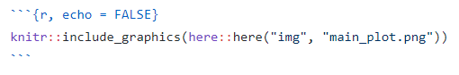
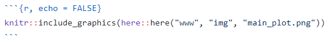
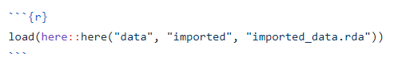
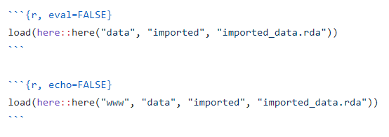
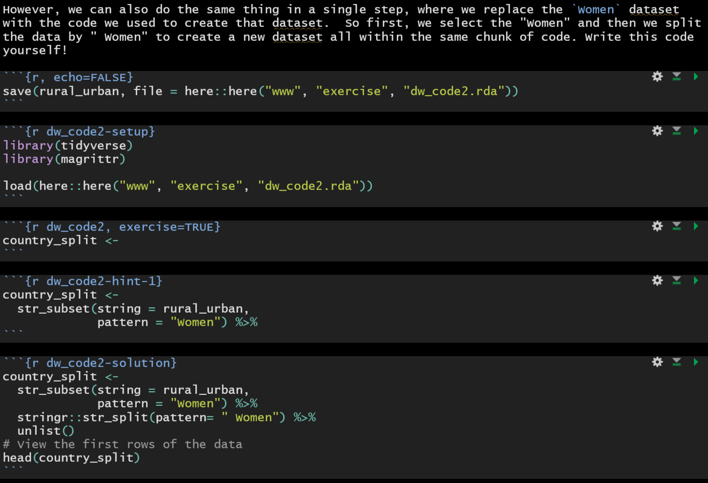
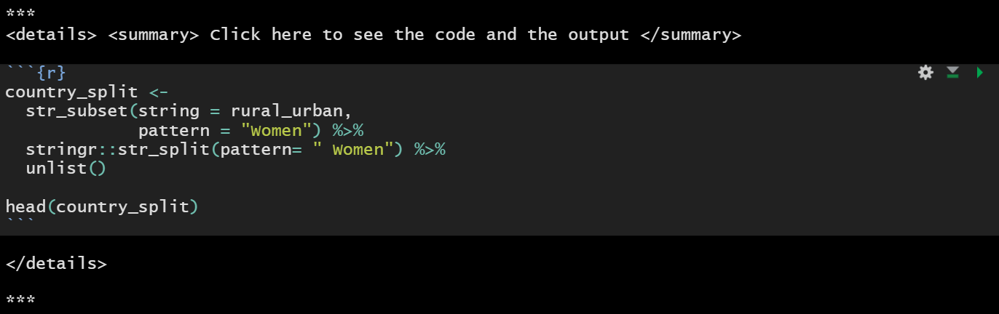
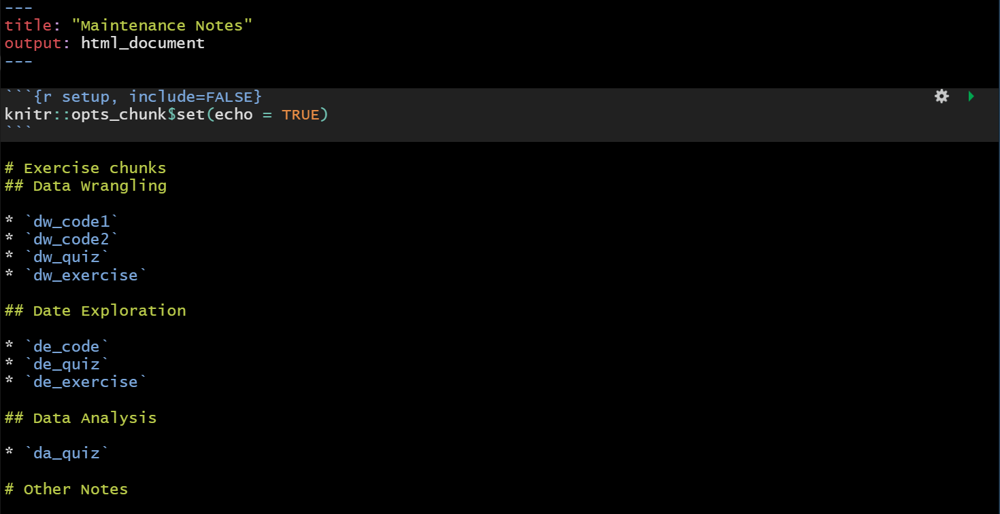

```{r setup, include=FALSE}
knitr::opts_chunk$set(include = TRUE, comment = NA, echo = TRUE,
                      message = FALSE, warning = FALSE, cache = FALSE,
                      fig.align = "center", out.width = '90%')
library(knitr)
library(here)

# additional libraries needed
library(learnr)
library(gradethis)
gradethis::gradethis_setup()
```

<!-- Open all links in new tab-->  
<base target="_blank"/> 

<p>&nbsp;</p>

This tutorial will guide you through how to create an interactive case study using a method where the entire case study is a single `learnr` tutorial hosted as a Shiny app.


# **1. Setting Up**
***

First you will need to be able to host your interactive case study using a method that supports R Shiny apps. For example, you can currently support 5 free apps per Shiny user. Otherwise, your institution may have paid to have an organizational Shiny Server license or an RStudio Connect (this is now called [Posit Connect](https://posit.co/products/enterprise/connect/) since RStudio changed it's name) license. 

You will also need to install some packages like `learnr` and `gradethis`.

```{r, eval = FALSE}
install.packages("learnr")
```


```{r, eval = FALSE}
# install.packages("remotes")
remotes::install_github("rstudio/gradethis")
```


Next, you need to decide which of the two methods you wish to use to make your case study interactive.

The two methods:

1) create individual shiny apps for each exercise and then add these to your typical case study using iframes
    - Pro: This can be a good option if you are using a lot of data and it might be slow for your case study to run and it is also easier to find what exercise to update overtime.
    - Con: This is a bit challenging to organize and if you are trying to use your shiny account you will run out of apps quickly!
2) create your case study as a learnR tutorial
   - Pro: This requires only one Shiny app, which may be critical if you don't want to pay for a license for Shiny.
   - Con: This can be slower to render and it can be more difficult to troubleshoot if your case study has an issue. It also changes the way the case sudy is formatted a bit.

If you prefer option 2 continue with this tutorial. 

## **`www` Directory**
***

Only the files in this `www` directory will be published with the `index.Rmd`.

In this `www` directory, we need to have:

* `style.css`
* `GA_Script.Rhtml`
*  move the `data`, `docs`, `img`, etc. directories of the static version into the `www` directory. These directories contain the files needed to render the `index.Rmd` file.
* Additionally, we need to make an **`exercise` sub-directory**. This is where we would put the `.rda` files for the "setup" of the exercises.

## **YAML Header**
***

Refer to the YAML header of this `.Rmd` file.

Important notes (the followings are different from the static version of case studies):

* title
* `css: www/style.css` (the statics version does not have the `www` directory)
* `in_header: www/GA_Script.Rhtml` (the statics version does not have the `www` directory - this is the script for google analytics if you decide to use that)
* the addition of `runtime: shiny_prerendered`

## **R Setup Chunk**
***

Refer to the setup chunk of this `.Rmd` file.

The main difference here is the addition of the the following libraries:

```{r, eval=FALSE}
library(learnr)
library(gradethis)
gradethis::gradethis_setup()
```


## **Translate**
***

Use the following code for translation

```
<div align="left" id="google_translate_element",></div>

<script type="text/javascript" src='//translate.google.com/translate_a/element.js?cb=googleTranslateElementInit'></script>

<script type="text/javascript">
function googleTranslateElementInit() {
  new google.translate.TranslateElement({pageLanguage: 'en'}, 'google_translate_element');
}
</script>
```

*Note: this is different from the statics version. There is an extra "comma" at the end of `id="google_translate_element"`. The translation tool would not work without this comma (not sure why).*

## **Table of Content**
***

You might want to get rid of the following css code from the static version

```
<style>
#TOC {
  background: url("https://opencasestudies.github.io/img/icon-bahi.png");
  background-size: contain;
  padding-top: 240px !important;
  background-repeat: no-repeat;
}
</style>
```

Unlike in the static version, this would not add the logo to the table of contents in the interactive app. Could work on how to add logo to the toc for interactive apps.

## **Optional: Add `exercise_block` to `www/style.css`**
***

You could add a specific style for the exercises by adding the following code to the `style.css` file:

```
.exercise_block {
    padding: .5em;
    border: 1px solid lightgrey;
    background: white;
    color: black;
}
```

#### {.exercise_block}

This is what the exercise block looks like. You might modify it if you want.

####


# **2. Modifications of the Static Version**
***

## **`data`, `docs`, `img`, etc. Directories are now Sub-Directories of `www`**
***


The file paths in the case study index.Rmd file that refer to these directories will need to be edited to reflect the new parent directory `www`. There are two cases of code chunks that will need to be edited slightly differently. I will use some examples to explain this. **A quick way to find where needs to be modified is to do `CTRL + F` and search for `here(`**


### Case 1: Static version chunk set to `echo = FALSE`

***
*When the static version has `echo = FALSE`:*



***

*Simply add the `www` directory to the interactive version:*



***

### Case 2: Static version chunk not set to `echo = FALSE`
***

*When the static version does not have `echo = FALSE`:*



***

*Set the original chunk to `eval = FALSE` and the new chunk to `echo = FALSE` in the interactive version:*



***


# **3. Add Exercises**
***

Each exercise chunk should have their own name. For example, `dw_code1` for the first coding problem embedded in the analysis of the "Data Wrangling" section, `dw_quiz` for the quiz of the "Data Wrangling" section, `dv_exercise1` for the first coding exercise of the "Exercise" subsection of the "Data Visualization" section, etc.

## **Coding Problems Embedded in the Analyses**
***

These could be the "Question Opportunities" ,or when an analysis is repeated with a different dataset and we want the students to come up with the code using what they learned, etc.

* First, before the exercise setup chunk, we need to save the dataset needed in the exercise as a `.rda` file and put it in the `exercise` sub-directory of the `www` folder.
* Then, in the exercise setup chunk, we need to load whatever libraries needed for this exercise that are not loaded in the `index.Rmd` setup chunk. In addition, we need to load the `.rda` made in the first step.
* Then, we can start making the exercise.
* Finally, when necessary, after the exercise, we can make a click to expend section containing the code and the output so that students may choose to skip these exercises.

Here is an example from the obesity case study:






## **The Exercise Subsection**
***

Each section (data wrangling, data visualization, etc.) could have their "Exercise" subsection as the last subsection.

### **Quizzes**
***

Following is an example from the CO2 case study:

```{r dw_quiz, echo = FALSE}
quiz(caption = "",
  question("Which one of the following functions in the `dplyr` package allows us to see all of the variables (columns) at once, where several values of those columns are shown on the right of the variable names?",
    answer("`slice_head()`", message = "This function allows us to see just the first rows of the data."),
    answer("`slice_sample()`", message = "This function allows us to see a selection of random rows of the data."),
    answer("`slice_tail()`", message = "This function allows us to see the rows at the end of the data."),
    answer("`glimpse()`", correct = TRUE),
    allow_retry = TRUE,
    random_answer_order = TRUE
  ),
  question("Which one of the pipe operators (from the `magrittr` package) should be used right after a variable name if we want to perform a sequence of operations on that variable, and meanwhile, assign the final output to that variable (without redefining that variable using `<-` or `=`)?",
    answer("`%>%`", message = "This operator cannot assign the final output to that variable."),
    answer("`%<%`", message = "This is not a valie pipe operator."),
    answer("`%T>%`", message = "This is the side-effects operator."),
    answer("`%<>%`", correct = TRUE),
    allow_retry = TRUE,
    random_answer_order = TRUE
  ),
  question("Which of the following can the `mutate()` function in the `dplyr` package do? (more than one correct answers)",
    answer("Select certain variables(columns) of the data.", message = "Selecting certain variables(columns) of the data is the function of the `select()` function."),
    answer("Rename a variable.", message = "Renaming a variable is the function of the `rename()` function."),
    answer("Create a new variable.", correct = TRUE),
    answer("Modify an existing variable.", correct = TRUE),
    allow_retry = TRUE,
    random_answer_order = TRUE
  )
)
```

### **Coding Exercise**
***

* Following is an example from the CO2 case study **without use of the `gradethis` package**:

#### {.exercise_block}

We have created a dataset called `wide_format` that is in "wide" format. Write some code to convert it to "long" format. (We want 3 columns with names "ID", "Variable", and "Value".)

```{r dw_exercise1-setup}
ID <- c(1, 2, 3)
Year <- c(2015, 2018, 2019)
Length <- c(20, 21.5, 19)
wide_format <- data.frame(ID, Year, Length)
```

```{r dw_exercise1, exercise=TRUE, exercise.eval=TRUE, exercise.lines = 5}
wide_format
```

```{r dw_exercise1-hint}
wide_format %>%
  pivot_longer()
```

```{r dw_exercise1-solution}
wide_format %>%
  pivot_longer(cols = -ID, names_to = "Variable", values_to = "Value")
```

####

<p>&nbsp;</p>

* Following is an example from the CO2 case study **with use of the `gradethis` package**:

#### {.exercise_block}

`mtcars` is a built-in R dataset as shown below. Use this dataset to complete the following exercise.

```{r}
mtcars
```

Write some code that will:

1. Create a new dataset called `new.mtcars` from `mtcars`.
2. Create a new column called `car` in `new.mtcars` that uses the values from the row names of `mtcars`. (Use the `rownames_to_column` function from the `tibble` package. See documentation [here](https://tibble.tidyverse.org/reference/rownames.html){target="_blank"}.)
3. Only keep the `car`, `mpg`, and `cyl` columns of this `new.mtcars` dataset.
4. Only keep the cars that have `cyl` = 4.
5. Rearrange the dataset by `mpg` in descending order.

*Note: replace the underscores("\_") with your code with one character per "\_". Click "Submit Answer" to check your answer. *

```{r dw_exercise2-setup}
library(tidyverse)
```

```{r dw_exercise2, exercise=TRUE, eval=FALSE}
# step 1
new.mtcars <- mtcars %>%
  # step 2
  rownames_to_column(var = "___") %>%
  # step 3
  ______(___, ___, ___) %>%
  # step 4
  ______(___ == _) %>%
  # step 5
  _______(____(mpg))

# view data (Do NOT include this part when submitting your answer!)
# new.mtcars
```

```{r dw_exercise2-hint-1}
# step 2:
# The "var" argument is the name of the new column that will use the values from the row names. What is the column name?
```

```{r dw_exercise2-hint-2}
# step 2:
# The "var" argument is the name of the new column that will use the values from the row names. What is the column name?

# step 3:
# Which function of the "dplyr" package select columns?
```

```{r dw_exercise2-hint-3}
# step 2:
# The "var" argument is the name of the new column that will use the values from the row names. What is the column name?

# step 3:
# Which function of the "dplyr" package select columns?

# step 4:
# Which function of the "dplyr" package subset rows?
```

```{r dw_exercise2-hint-4}
# step 2:
# The "var" argument is the name of the new column that will use the values from the row names. What is the column name?

# step 3:
# Which function of the "dplyr" package select columns?

# step 4:
# Which function of the "dplyr" package subset rows?

# step 5:
# Which function of the "dplyr" package will reorder the data?
# What argument do we need to reorder in descending order?
```

```{r dw_exercise2-hint-5}
# Next hint will show you the solution
```

```{r dw_exercise2-solution}
new.mtcars <- mtcars %>%
  rownames_to_column(var = "car") %>%
  select(car, mpg, cyl) %>%
  filter(cyl == 4) %>%
  arrange(desc(mpg))
```

```{r dw_exercise2-check, eval=FALSE}
grade_code()
```

####


# **4. Maintenance Notes**
***

See the `maintenance_notes.Rmd` file as an example.

Make sure to list the names of the exercise chunks for future maintenance. Except for things mentioned in this tutorial, other changes should be noted as well.



# **5. Publishing**
***

Make sure the `rsconnect` folder is also pushed to GitHub.